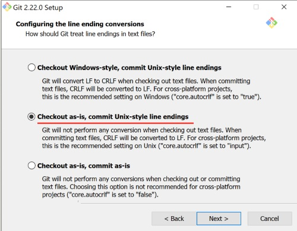

# GIT & GITHUB

Работа с git и github. Здесь все о работе с версиями и репозиториями.

## GITHUB

1. Вначале идем на [github](https://github.com) и создаем аккаунт.
2. После создания аккаунта у нас в правом верхнем углу браузера есть кнопка "New Repository"
   
3. Создаем репозиторий. Выбираем имя нашего репозитория и ставим галочку в `Public` и жмем зеленую кнопку создать!
4. И теперь есть два варианта :
   1. надо начать работу локально на компьютере
   2. или присоединить и закачать уже готовый проект с локального компьютера.

## Git Установка и начальная конфигурация

1. **Установка**. Здесь только описание по установке [git для Windows](https://git-scm.com/download/win)
Во время установки нам понадобиться уделить внимание "Configuration Line Endings" опции это и разобраться для чего эта опция нужна  
  
__"Checkout as-is, commit Unix-style line endings"__ Когда вы начнете работать и у вас будут проекты, где разработчики используют Линукс и Винды , то эта опция очень удобна. Тк сохранять будет в Unix-style, а все локально будут работать удобно...  
Также это можно изменить командой `git config --global core.autocrlf ...` опции `true` ,`input` и `false` после установки.
2. Сразу после установки git рекомендуеться занести имя пользователя и адрес электронной почты в конфигурации git  
   `git config --global user.name "ваше имя"`  
   `git config --global user.email "ваш email"`

## Visual Studio Code

Когда базовые настройки в git завершены можно разобраться с инструментом разработки Visual Studio Code.  
Этот редактор сразу распознает установлен ли git у вас на компьютере или нет.  
На примере этого редактора мы расмотрим основы работы с по сохранению версий с использованием git.

